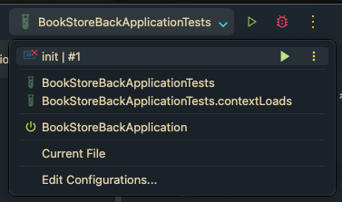
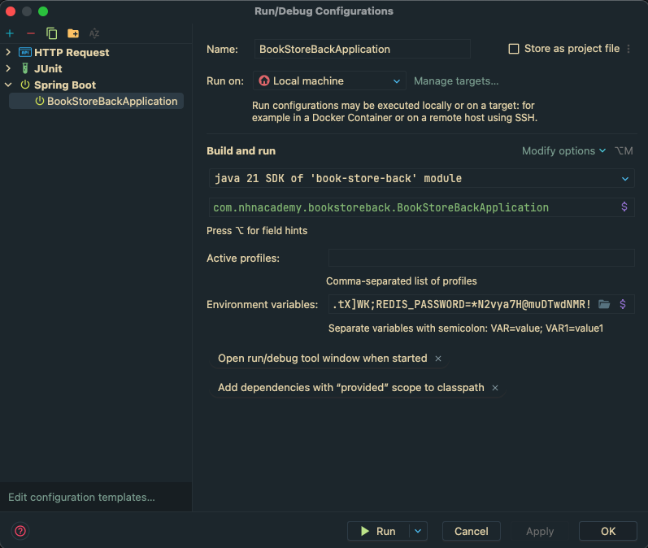
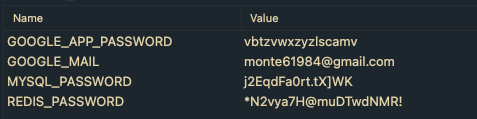

# 애플리케이션 서버 application.yml

```yaml
${MYSQL_PASSWORD}   j2EqdFa0rt.tX]WK
${REDIS_PASSWORD}   *N2vya7H@muDTwdNMR!
```

# 프로퍼티 파일의 암호화 설정 방법

1. 우측 상단 실행 버튼 왼쪽에 메뉴바 선택
2. Application을 활성화한 상태에서 “**Edit Configurations…**” 클릭



1. “Environment variables: “ 태그에서 `$` 표시 클릭



1. 오른쪽 이미지와 같이 창이 뜨면 최상단에 값들을 복사 붙여넣기 한다.

   (이 때, `$`, `{}` 는 제거)




1. OK → Apply → OK 종료

## ⚠️ Application만 설정해선 안 되고, TEST 환경에도 적용을 해야하기 때문에 1의 과정에서 진행할 테스트에 대해서도 똑같이 반복해야합니다