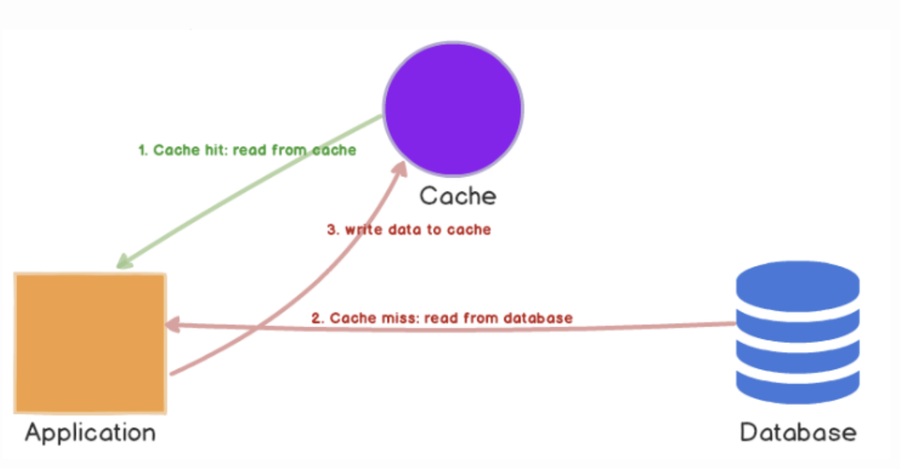
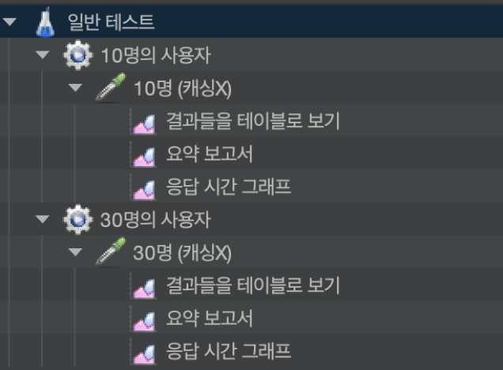
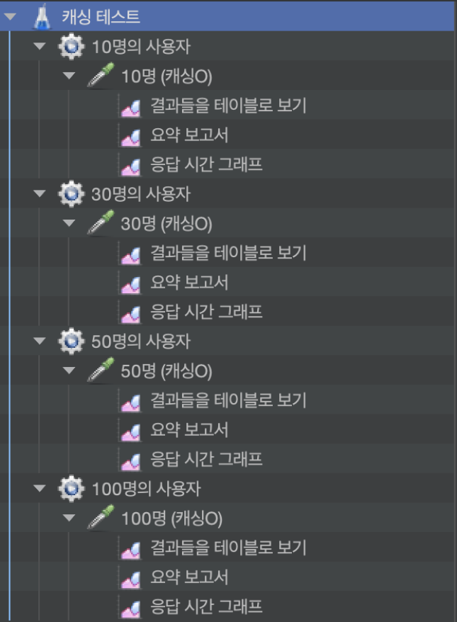
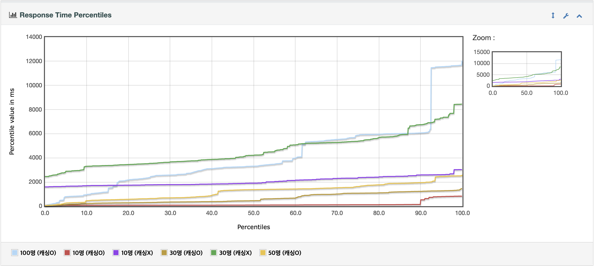
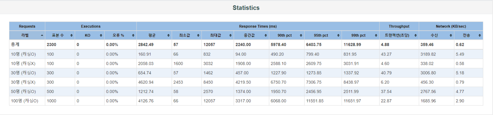

# Redis Cache

Redis는 오픈 소스 인메모리 데이터 구조 저장소로, 다양한 데이터 구조를 지원하며 높은 성능과 확장성을 제공합니다. Redis는 특히 캐시로 많이 사용되며, 다음과 같은 특징과 장점이 있습니다.

## Redis 캐시의 특징

1. **인메모리 저장소**:
    - 데이터를 디스크가 아닌 메모리에 저장하여 매우 빠른 읽기 및 쓰기 속도를 제공합니다. 이는 캐시의 주요 요구 사항인 속도에 매우 적합합니다.

2. **다양한 데이터 구조**:
    - 단순한 키-값 쌍뿐만 아니라, 리스트, 셋, 해시, 정렬된 셋, 비트맵, 하이퍼로그로그 등 다양한 데이터 구조를 지원합니다. 이는 복잡한 데이터 저장 및 조회 요구 사항을 충족시킵니다.

3. **지속성**:
    - Redis는 데이터를 메모리에 저장하지만, RDB(Snapshotting)와 AOF(Append-Only File) 방식으로 데이터를 디스크에 영속화할 수 있어 데이터 손실을 방지할 수 있습니다.

4. **복제 및 고가용성**:
    - Redis는 마스터-슬레이브 복제를 지원하여 고가용성을 보장합니다. 또한, Redis Sentinel을 통해 자동 장애 조치 및 모니터링 기능을 제공합니다.

5. **클러스터링**:
    - Redis 클러스터를 통해 수평적 확장을 지원하며, 데이터 샤딩을 통해 큰 데이터 세트를 여러 노드에 분산 저장할 수 있습니다.

6. **트랜잭션**:
    - Redis는 MULTI, EXEC, DISCARD, WATCH 명령어를 사용하여 기본적인 트랜잭션을 지원합니다.

7. **스크립팅**:
    - Lua 스크립트를 통해 서버 측에서 복잡한 연산을 수행할 수 있습니다.

## Redis 캐시의 장점

1. **높은 성능**:
    - 메모리 기반의 데이터 저장소로 매우 빠른 응답 시간을 제공합니다. 수십만 QPS(Queries Per Second)를 처리할 수 있습니다.

2. **다양한 사용 사례**:
    - 세션 관리, 실시간 분석, 메시지 브로커, 순위표, 작업 큐 등 다양한 애플리케이션 시나리오에서 활용됩니다.

3. **유연성**:
    - 다양한 데이터 구조와 명령어를 통해 복잡한 데이터를 효율적으로 관리할 수 있습니다.

4. **확장성**:
    - 클러스터링을 통해 대규모 데이터 세트와 높은 트래픽을 처리할 수 있습니다.

## Redis 캐시의 단점

1. **메모리 의존성**:
    - 모든 데이터를 메모리에 저장하기 때문에, 메모리 용량이 한정된 환경에서는 비용이 증가할 수 있습니다.

2. **복잡성**:
    - 복제, 클러스터링, 지속성 설정 등 고급 기능을 설정하고 관리하는 데 있어 복잡성이 증가할 수 있습니다.

## Redis 캐시 사용
**메인 페이지 캐싱**
    - 메인 페이지의 카테고리 목록, 베스트 셀러 리스트 10권, 최다 좋아요 도서 리스트 10권, 신간도서 리스트 10권을 Redis에 캐시하여, 빠른 페이지 로딩과 서버 부하 감소를 실현

---
# Cache Aside 전략
캐시를 옆에 두고 필요할 때만 데이터를 캐시에 로드하는 전략
- 읽기가 많은 워크로드에 적합
- 캐시 분리를 사용하였기 때문에 캐시 클러스터가 다운되어도 시스템 전체의 오류를 발생시키지 않음

출처: https://wnsgml972.github.io/database/2020/12/13/Caching/

---
# Jmeter
JMeter는 Apache Software Foundation에서 개발한 오픈 소스 성능 테스트 도구로, 웹 애플리케이션 및 다양한 서비스의 성능 테스트와 부하 테스트를 수행할 수 있습니다. JMeter는 Java로 작성되었으며, 사용하기 쉬운 그래픽 사용자 인터페이스(GUI)와 강력한 기능을 제공합니다.

## Thread properties
- `스레드 개수`: 10, 30, 50, 100 단위의 다중 사용자 환경으로 측정
- `반복 횟수`: 10번

## 1. General TestCase

## 2. Cache TestCase

## 3. Jmeter 응답 시간대 별 퍼센트 그래프

## 4. Jmeter 통계

### 평균 응답 시간 향상률
- 캐싱을 사용하면 평균 응답 시간이 10명일 때 92.18%, 30명일 때 85.83% 개선

### 처리율 향상률
- 캐싱을 사용하면 처리율이 10명일 때 약 9.4배, 30명일 때 6.5배 증가

## 결론
- Redis를 활용한 캐싱이 응답 시간과 처리율에서 모두 큰 성능 향상
- 같은 시간 대비 더 많은 동시 사용자 수 처리 가능