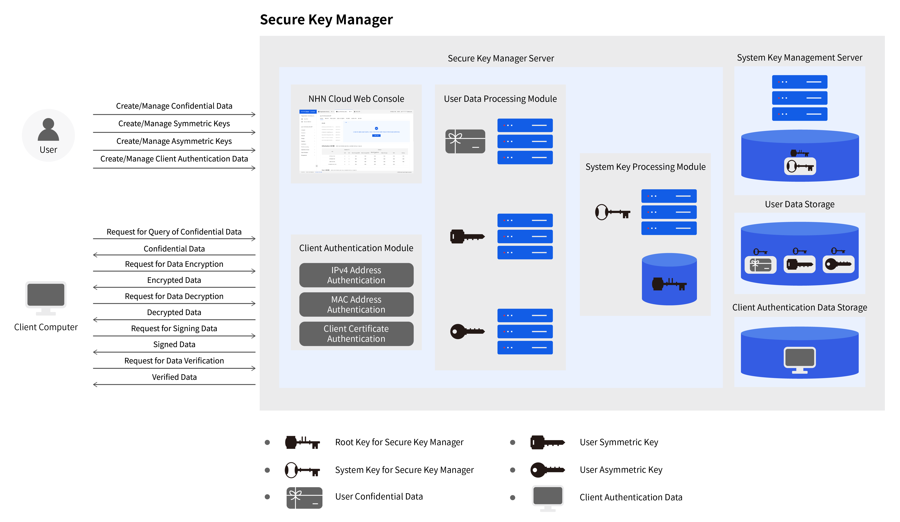
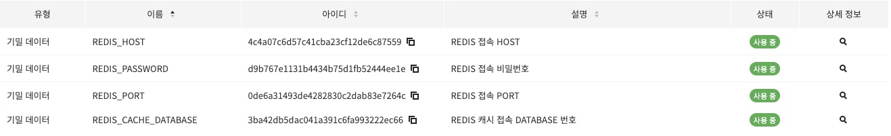

# Secure Key Manager

Secure Key Manager 는 사용자의 중요 데이터를 안전하게 보관하고 접근 권한을 제어하는 서비스입니다. 사용자는 Secure Key Manager에 기밀 데이터, 대칭키, 비대칭키를 저장할 수 있습니다. Secure Key Manager에 저장한 데이터는 사용자가 설정한 인증 방법을 통과한 클라이언트만 접근할 수 있습니다.

---
## 주요 기능

### 데이터 관리
- 기밀 데이터 등록, 관리, 조회
- 대칭키 생성, 관리, 회전, 데이터 암/복호화, 조회
- 비대칭키 생성, 관리, 회전, 데이터 서명/검증, 조회

### 데이터 접근 제어
- 클라이언트 IPv4 주소를 사용한 데이터 접근 제어
- 클라이언트 MAC 주소를 사용한 데이터 접근 제어
- 클라이언트 인증서를 사용한 데이터 접근 제어

### 승인 기능
- 데이터, 데이터 접근 제어의 변경을 승인자, 요청자로 나누어 관리


---
## 서비스 구조
서비스 구조
Secure Key Manager는 사용자 데이터를 안전하게 보관하기 위해 루트키와 시스템키라는 두 개의 암호키를 내부적으로 사용합니다. 루트키는 시스템키를 보호하기 위해 사용하며 시스템키는 사용자 데이터를 보호하기 위해 사용합니다. 시스템키는 루트키로 암호화해서 Secure Key Manager 시스템키 관리 서버에 저장합니다. Secure Key Manager 서버는 서비스를 시작할 때 인증 과정을 거쳐서 Secure Key Manager 시스템키 관리 서버로부터 암호화된 시스템키를 가져옵니다. 루트키를 사용해서 복호화하면 시스템키 처리 모듈이 시스템키를 사용할 수 있는 상태가 됩니다. Secure Key Manager에 저장한 사용자 데이터를 비정상적인 방법으로 접근하려면 물리적으로 분리된 세 개의 시스템에서 루트키, 시스템키, 사용자 데이터를 모두 획득해야 합니다.

사용자는 NHN Cloud 웹 콘솔에서 Secure Key Manager를 관리할 수 있습니다. 웹 콘솔은 사용자 데이터 생성/관리, 클라이언트 인증 데이터 생성/관리 등의 기능을 제공합니다. Secure Key Manager에서 생성한 모든 사용자 데이터는 시스템키로 암호화해서 사용자 데이터 저장소에 저장합니다. 클라이언트 인증 데이터는 일부 중요 정보를 시스템키로 암호화해서 클라이언트 인증 데이터 저장소에 저장합니다.

Secure Key Manager는 클라이언트 서버에서 사용할 수 있는 다양한 API를 제공합니다. 클라이언트 서버는 기밀 데이터 조회, 대칭키를 사용한 암/복호화, 비대칭키를 사용한 서명/검증을 요청할 수 있습니다. 클라이언트 인증 모듈은 클라이언트 인증 데이터를 사용해서 클라이언트의 요청을 허가할지 결정합니다. 클라이언트의 요청이 허가되면 사용자 데이터 처리 모듈은 시스템키 처리 모듈을 사용해서 암호화된 사용자 데이터를 복호화한 후 서비스를 제공합니다.


https://docs.nhncloud.com/ko/Security/Secure%20Key%20Manager/ko/overview/
---
# 예제 (Redis)

## API 요청에 대한 응답 DTO
```java
@Getter
public class KeyResponse {
	private Header header;
	private Body body;

	@Getter
	@NoArgsConstructor
	public static class Body {
		private String secret;
	}

	@Getter
	@NoArgsConstructor
	public static class Header {
		private Integer resultCode;
		private String resultMessage;
		private boolean isSuccessful;
	}
}
```

## @ConfigurationPropertiesScan 설정

Spring Boot 애플리케이션에서 @ConfigurationProperties 어노테이션을 사용한 클래스를 스캔하도록 지시합니다. 이 어노테이션은 외부 설정 파일(application.yml 또는 application.properties)에 정의된 설정을 Java 객체에 바인딩할 때 사용됩니다.
```java
@ConfigurationPropertiesScan
public class BookStoreFrontApplication {

	public static void main(String[] args) {
		SpringApplication.run(BookStoreFrontApplication.class, args);
	}

}
```

## RedisProperty.class
```java
@Getter
@Setter
@ConfigurationProperties("oritang.redis")
public class RedisProperty {
	private String host;
	private String port;
	private String password;
	private String database;
}
```

## application.yml 설정
- Secure Key Manager 서비스에 등록한 기밀데이터의 ID 값을 프로퍼티에 커스텀 설정

```properties
oritang:
    redis:
        host: 4c4a07c6d57c41cba23cf12de6c87559
        port: 0de6a31493de4282830c2dab83e7264c
        password: d9b767e1131b4434b75d1fb52444ee1e
        database: 3ba42db5dac041a391c6fa993222ec66
```

## RedisConfig.class
```java
@Slf4j
@Configuration
@RequiredArgsConstructor
public class RedisConfig {
	private final RedisProperty redisProperty;
	private final KeyManagerService keyManagerService;

	@Bean
	public RedisConnectionFactory redisConnectionFactory() {
		RedisStandaloneConfiguration redisStandaloneConfiguration = new RedisStandaloneConfiguration();
		redisStandaloneConfiguration.setHostName(keyManagerService.getSecret(redisProperty.getHost()));
		redisStandaloneConfiguration.setPort(Integer.parseInt(keyManagerService.getSecret(redisProperty.getPort())));
		redisStandaloneConfiguration.setPassword(keyManagerService.getSecret(redisProperty.getPassword()));
		redisStandaloneConfiguration.setDatabase(
			Integer.parseInt(keyManagerService.getSecret(redisProperty.getDatabase())));
		return new LettuceConnectionFactory(redisStandaloneConfiguration);
	}

	@Bean
	public RedisTemplate<String, Object> redisTemplate(RedisConnectionFactory redisConnectionFactory) {
		RedisTemplate<String, Object> sessionRedisTemplate = new RedisTemplate<>();
		sessionRedisTemplate.setConnectionFactory(redisConnectionFactory);
		sessionRedisTemplate.setKeySerializer(new StringRedisSerializer());
		sessionRedisTemplate.setValueSerializer(new GenericJackson2JsonRedisSerializer());
		sessionRedisTemplate.setHashKeySerializer(new StringRedisSerializer());
		sessionRedisTemplate.setHashValueSerializer(new GenericJackson2JsonRedisSerializer());
		return sessionRedisTemplate;
	}
}

```

## KeyManagerService.class
```java
@Slf4j
@Component
@RequiredArgsConstructor
public class KeyManagerService {
	private final RestTemplate restTemplate;
	
	public String getSecret(String keyId) {
		try {
			// HTTP 요청을 위한 헤더 설정
			HttpHeaders headers = new HttpHeaders();
			headers.setContentType(MediaType.APPLICATION_JSON);
			headers.setAccept(List.of(MediaType.APPLICATION_JSON));
			headers.set("X-TC-AUTHENTICATION-ID", "3bTA7VD3xkZzLXPnt31X");
			headers.set("X-TC-AUTHENTICATION-SECRET", "WuXXhpYwgdSoE3mY");

			// URI 생성
			String url =
				"https://api-keymanager.nhncloudservice.com/keymanager/v1.2/appkey/2SxwmBzUfnqJaA2A/secrets/" + keyId;

			// HttpEntity 를 사용하여 헤더 포함
			HttpEntity<String> entity = new HttpEntity<>(headers);

			// 데이터 요청 및 반환
			ResponseEntity<KeyResponse> responseEntity = restTemplate.exchange(url, HttpMethod.GET, entity,
				KeyResponse.class);
			KeyResponse responseBody = responseEntity.getBody();
			if (responseBody != null) {
				return responseBody.getBody().getSecret();
			} else {
				log.error("응답 본문이 비어있습니다.");
				return null;
			}
		} catch (Exception e) {
			log.error("키매니저 에러: {}", e.getMessage());
			return null;
		}
	}
}
```