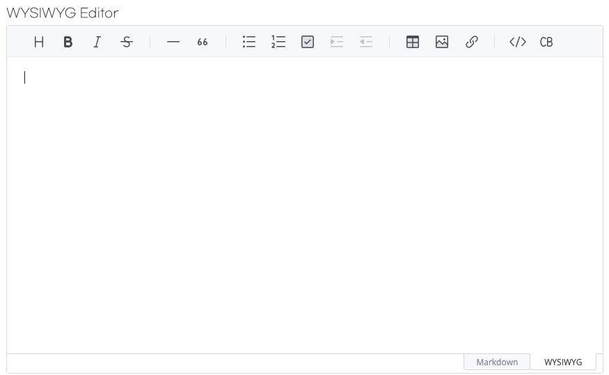
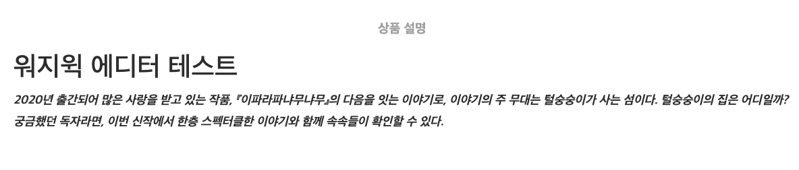

# WYSIWYG Editor
WYSIWYG은 “What You See Is What You Get”의 약자로, 사용자가 문서나 웹 페이지를 편집할 때 실제 출력물(예: 브라우저에 표시될 웹 페이지)과 동일하게 보이는 방식으로 편집할 수 있는 환경을 의미합니다. WYSIWYG 편집기는 비전문가도 복잡한 형식의 문서나 웹 페이지를 쉽게 만들 수 있도록 도와줍니다.

---
# Toast UI Editor 3.0 사용

- html
```angular2html
<head>
    <link rel="stylesheet" href="https://uicdn.toast.com/editor/latest/toastui-editor.min.css">
</head>

<body>
    <div id="editor"></div>
</body>

<script src="https://uicdn.toast.com/editor/latest/toastui-editor-all.min.js"></script>
```

- javascript
```javascript
document.addEventListener('DOMContentLoaded', function () {
    const editor = new toastui.Editor({
        el: document.querySelector('#editor'),
        height: '500px',
        initialEditType: 'wysiwyg',
        previewStyle: 'vertical'
    });
});
```

---
- UI



- 실제 출력
