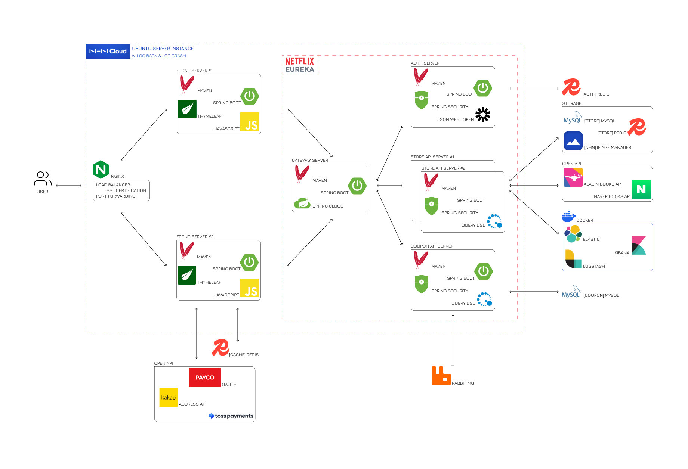

## 인스턴스 주소
- **IP 주소**: 133.186.134.30

## 웹 서버
- **Nginx**: 포트 80

## 애플리케이션 서버
- **프론트엔드 1**: 포트 8081
- **프론트엔드 2**: 포트 8082
- **백엔드**: 포트 8083
- **쿠폰 서비스**: 포트 9494
- **회원 서비스**: 포트 8070

## 서비스 등록 및 관리
- **유레카 서버**: 포트 8761

## API 게이트웨이
- **게이트웨이**: 포트 8090

## 데이터 처리
- **도커 Elasticsearch**: 포트 9200 / 9300
- **도커 Kibana**: 포트 5601
- **도커 Logstash**: 포트 5044
